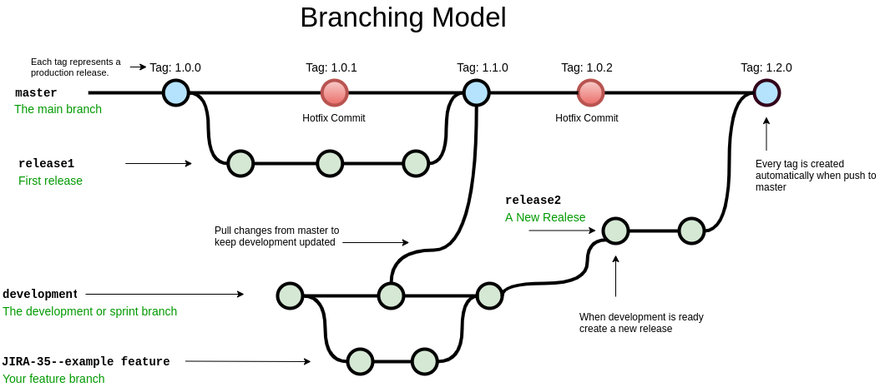

# Handytec Test

This repository contains the code of a basic ***React JS*** app and some files to implement the ***CI/CD*** process using ***Github Actions***, build **Docker Images and push them to Docker Hub** and deploy the code to ***Heroku***.

## Branching Model
For this project works with the next types of branches:

 - **master:** This is the production branch, all the code in master branch is production ready code, every new release is merged to this branch using a Pull Request, when something is pushed to branch a new version tag with the form *vX.X.X* is created automatically.
 - **release:** This branch contains the new features that will be merged in master to added it as new production code, releases branches are used for QA to verify that the changes are working as expected. This branch is created from the development branch.
 - **development:** This is the branch that contains the latest code, is used to merge the changes of all the feature branches created by the developers, when a new feature y ready to testing a release branch is created from here. Also is needed to regularly pull changes from master to keep development updated for changes made in releases or hotfix branches.
 - **hotfix:** This branch is used when a change is required in production as soon as possible, this branch is created from master and pushed back again to solve the problem.

The next image shows how this implementation works.



## Merging Considerations 

To keep a correct functionality you must follow this rules to keep a good quality of code and avoid errors when merge branches:

 - All merges to development, release and master branch are made with a pull request that must be reviewed and approved  by the architect or the senior developer of the project.
 - A merge is only allowed if the tests from the continuous integration system passed. 
 -  Keep development branch all the time pulling regularly changes from master.
 - Create one release at the time and merge it to master to continue to another.

## Continuous Integration

The system for continuous integration is created using Github Actions, the file containing the configuration is located in ***.github/workflows/main.yaml*** and works in this way:

 - Any change pushed to any branch trigger the pipeline to run the unit tests of the project.
 - When a change is pushed to the braches development, release or master a docker image is created with this code and pushed to the images repository DockerHub [https://hub.docker.com/repository/docker/steveozo/snapshot-frontend](https://hub.docker.com/repository/docker/steveozo/snapshot-frontend)

## Continuous Deployment

The continuous deployment is triggered when the continuous integration process ends, the deploy only happens when the push was to the development, release or master branch and works in this way:

 - **development:** the code is built and deployed to the development environment. [https://handytec-dev.herokuapp.com/](https://handytec-dev.herokuapp.com/)
 - **release:** the code is built and deployed to the testing environment. [https://handytec-test.herokuapp.com/](https://handytec-test.herokuapp.com/)
 - **master:** the code is built and deployed to the master environment. [https://handytec-prod.herokuapp.com/](https://handytec-prod.herokuapp.com/)

After every deployment a health check is configured in the pipeline to check that the deployment was created correctly and the app is still working.

## Local Development

To start a local development of this application download the code and execute the commands:
```
# Check that you have node and yarn installed in your system
yarn install
yarn start
```
If you want to setup a docker version of development, release or master you can use a docker image from this repository [https://hub.docker.com/repository/docker/steveozo/snapshot-frontend](https://hub.docker.com/repository/docker/steveozo/snapshot-frontend)
The image tags are created in the form of branch-buildNumber, for example master-13
To run the image in your machine execute:

    #Check that you have docker installed and the port 80 is not used by another application
    docker run -it -p 80:80 steveozo/snapshot-frontend:master-13


## Executing the CI/CD
To check that the CI/CD is working follow this steps:

 - Create a branch from development
 - Make changes in this branch and push to github.
 - Check that the tests passed and create a pull request to merge this branch into development.
 - After the pull request is approved and merged the changes will be deployed in the heroku dev environment.
 - Create a branch with the name **release** from development.
 - This branch **release** will trigger a deploy to the heroku test environment and you can appreciate the changes.
 - Create a pull request from this **release** branch to the **master** branch.
 - After the tests passed and the pull request was approved and merged the changes will be available in the heroku prod environment and a new tag is created in giithub. For default the patch number is increased in every merge to master, unless you can change this version number if in any commit to master you include some of this rules [https://github.com/marketplace/actions/github-tag#bumping](https://github.com/marketplace/actions/github-tag#bumping)
  